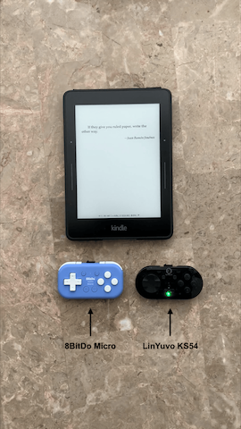

# Demo

# Step 0: Pre-requisites
- A jailbroken Kindle
	- Follow installation instructions [here](https://kindlemodding.org/jailbreaking/WinterBreak/#installation-guide) to jailbreak your Kindle
- KOReader installed on your jailbroken Kindle
	- Follow Step 3 in the installation instructions [here](https://github.com/KOReader/KOReader/wiki/Installation-on-Kindle-devices#installation) to install KOReader
- Any gamepad controller (I have tested the [8BitDo Micro](https://www.8bitdo.com/micro/) and [LinYuvo KS54](https://www.aliexpress.us/item/3256806718193872.html))
- An iOS/macOS device with the Shortcuts app

# Step 1: Launch KOReader on your Kindle
- In the stock Kindle library UI, open the `KUAL` book > Select `KOReader` > Select `Start KOReader (ASAP)`
	- This step can be simplified with [this](../scriptlets/KOReader.sh) scriplet, which creates a `KOReader` book in the Kindle library and immediately launches KOReader when it's opened
		- To do so: Download the scriplet > Tap the top middle area of the Kindle > Select `Main` (3 lines icon) > Select `Exit` > Plug in your Kindle to your Mac > On the left side bar of Finder under `Locations`, select `Kindle` > Select `documents` > Drag and drop the scriptlet into the folder > Eject `Kindle`
		- If you would also like to add the KOReader logo to the scriplet, download [this](../assets/koreader_logo.png) image > On the left side bar of Finder under `Locations`, select `Kindle` > Select `koreader` > Select `resources` > Drag and drop the image into the folder > Eject `Kindle`

# Step 2: Set up KOReader
- Turn on `Wifi`
	- Tap the top middle area of the Kindle > Select `Settings` (Gear icon) > Select `Network` > Check `Wi-fi connection` 
- Get your IP address
	- Tap the top middle area of the Kindle > Select `Settings` (Gear icon) > Select `Network` > Select `Network info` >  Look at`IP`
- Turn on the `KOReader HTTP Inspector`
	- Tap the top middle area of the Kindle > Select `Tools` (Wrench icon) > Select `More tools` (on Page 2) > Select `KOReader HTTP Inspector` > Select `Start HTTP server`
	- Get the port number (default port: `8080`)

> Optional: Check out the [KOReader user guide](https://koreader.rocks/user_guide/) to further configure KOReader to your liking

# Step 3: Set up Shortcuts on your Mac
- Create a new Shortcut > Set a name and icon for the Shortcut > Add the `Get Contents of URL` action > Click on `Show More` and make sure the method is set to `GET` (leave `Headers` empty)
- Enter a URL based on the following format: `http://YOUR_IP_ADDRESS:PORT_NUMBER/koreader/event/...`
	- For a list of all events, go to `http://YOUR_IP_ADDRESS:PORT_NUMBER/koreader/event/` (e.g., `http://192.168.0.1:8080/koreader/event/`) in your browser
	- Examples
		- Go to the next page: `http://YOUR_IP_ADDRESS:PORT_NUMBER/koreader/event/GotoViewRel/1`
		- Go to the previous page: `http://YOUR_IP_ADDRESS:PORT_NUMBER/koreader/event/GotoViewRel/-1`
- Create a keyboard shortcut for each Shortcut: Click on the `Info` button on the right sidebar > Click the `Add Keyboard Shortcut` button > Set the keyboard shortcut
	- I recommend using `Ctrl`, `Shift`, and `Option` keys along with a letter for each keyboard shortcut (e.g., `Ctrl+Shift+Alt+s`)

# Step 4: Remap the buttons on your gamepad controller to keyboard shortcuts
## 8BitDo Micro
- Download and launch the [8BitDo Ultimate Software](https://apps.apple.com/us/app/8bitdo-ultimate-software/id1532713768) app on your iPhone/iPad
- Turn on `Bluetooth` on your iPhone/iPad > At the bottom of the controller, switch the mode to `K` (keyboard) > Press and hold the button next to the switch to connect it to your iPhone/iPad
	- When it's trying to connect, the light will flash and when it's successfully connected, the light will stop flashing
- Toggle on `Disable Sleep`
- Remap the buttons to the the keyboard shortcuts you set up in [Step 3](#step-3-set-up-shortcuts-on-your-mac) using `Key combos` (see [this](https://support.8bitdo.com/ultimate/micro.html) page for more info)
	- Select `Null` if you don't want the button to have a keyboard shortcut
	- Once you're done remapping the buttons, select `Sync to device`

## LinYuvo KS54
> NOTE: We need to use the `Karabiner-Elements` app because the `Keylinker` app that LinYuvo suggests to users doesn't natively allow buttons on the controller to be remapped to keyboard shortcuts. Using `Karabiner-Elements` should theoretically also work to remap buttons of controllers from other brands

- Turn on `Bluetooth` on your Mac and connect the controller by pressing the `Home` and `A` buttons together (the light on the controller should be **green**)
	- When it's trying to connect, the light will flash and when it's successfully connected, the light will stop flashing
	- The controller should appear as `KeyBoard` - you can rename it to anything (e.g., `LinYuvo (Keyboard)`)
- Download and launch the [Karabiner-Elements](https://karabiner-elements.pqrs.org) app on your Mac (it's free and open-source)
	- After giving the app with the necessary permissions, select the `Devices` tab on the left sidebar. You should see `LinYuvo (Keyboard) (No manufacturer name)` as a device > Toggle on `Modify events`
- Remap the buttons on the controller using `Karabiner-Elements`
	- Select the `Complex Modifications` tab > click the `Add your own rule` button > Delete all the pre-filled text
	- Copy the text from [this](./karabiner-elements.json) JSON file and modify the `to: [{"key_code": "...", "modifiers": ["...", "..."]}]` accordingly > Paste the text in the textbox > Click the `Save` button
	- To check that the buttons are properly remapped, launch the `Karabiner-EventViewer` app and press the buttons to see the updated key codes

# Limitations
- The Kindle will go to sleep after a configured time if it hasn't registered a touch input
- These steps are limited to those in the Apple ecosystem. Alternatives to the `Shortcuts` app is necessary for those with Android devices